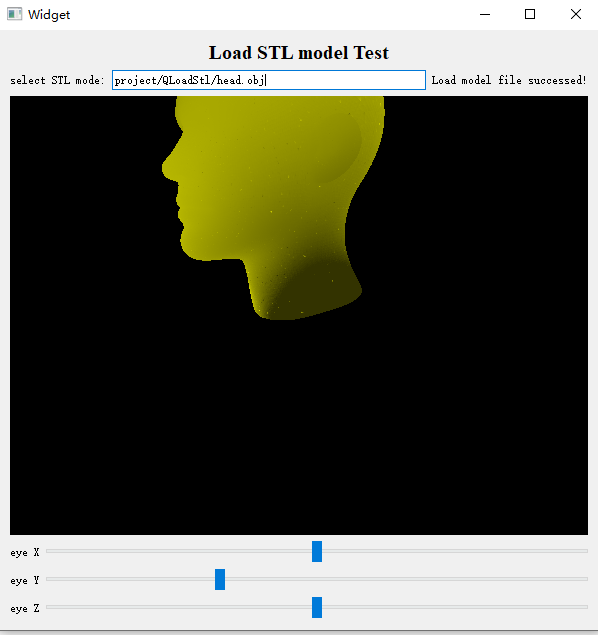

## Author
- **Welin**  2020.12.29
- modified in 2020.12.29

## Overview
In the repository, it provides some ways to combine Qt library and OpenGL library. The OpenGL library could be found in [freeglut](http://freeglut.sourceforge.net/), a good wrapper for OpenGL. For the Qt environment, there are so many ways to install.

## Description
* In project QLoadStl, it is a Qt project generated by QtCreator. And it is used for how to load stl file and display in the UI. Effect as below.

Enjoy!

